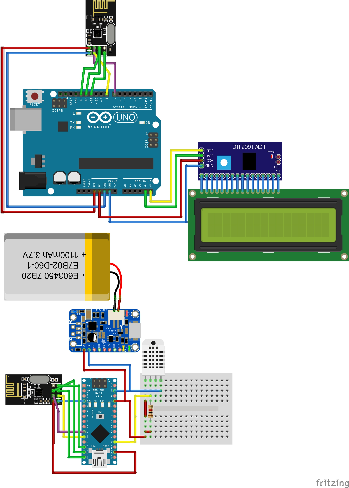

# Weather station

### Used libraries
- DHT [GitHub](https://github.com/adafruit/DHT-sensor-library)
- LowPower [GitHub](https://github.com/rocketscream/Low-Power)
- NRF24 [GitHub](https://github.com/nRF24/RF24)
- LiquidCrystal (in repo)

## Breadboard Schematic

